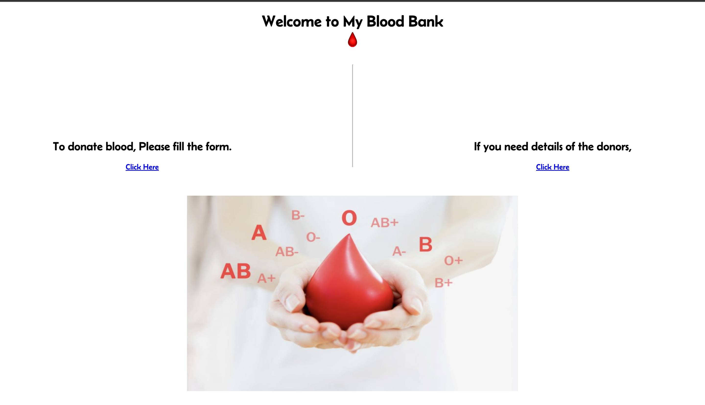
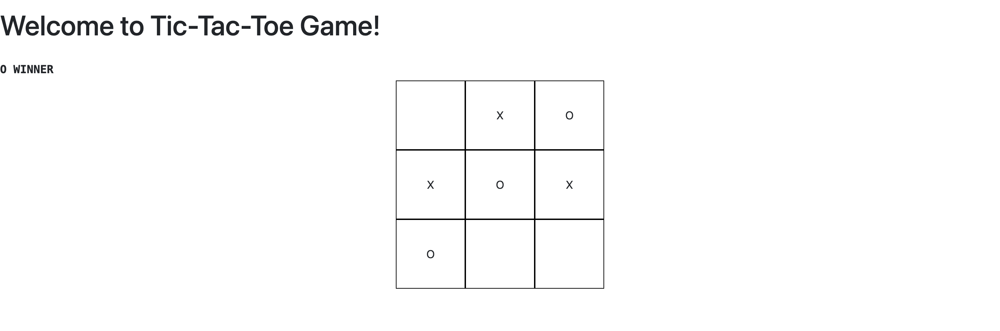

# My Portfolio

Welcome to my portfolio, built using React.js. This repository showcases my web development skills and the projects I've worked on. Here, you'll find information about me, my projects, and how to reach out to me.

## About Me

I'm Charan, a passionate web developer focusing on front-end development. I specialize in building modern, responsive web applications using React, HTML, CSS, and JavaScript technologies.

## Projects

### Project 1: [Personal Portfolio](https://itscharanteja.github.io/personal-portfolio/#portfolio)

This is my portfolio based on my skill-based work.

### Project 2: [Blood Bank](https://github.com/itscharanteja/BloodBank)

This project is my internship project based on blood donor information. This website is built using HTML, CSS, and JS.

### Project 3: [Tic-Tac-Toe](https://github.com/itscharanteja/Tic-Tac-Toe-React)

This is a simple web game called Tic-Tac-Toe also known as XO Game.

## Skills

- HTML5
- CSS3
- JavaScript
- React.js
- Git/GitHub
- Responsive Design
- UI/UX Design

## Contact

Provide information on how people can reach out to you:

- **Email:** [itscharanteja789@gmail.com](mailto:itscharanteja789@gmail.com)
- **LinkedIn:** [LinkedIn Profile](https://www.linkedin.com/in/charan-sri-teja-b-a386a5225/)
- **GitHub:** [GitHub Profile](https://github.com/itscharanteja)
